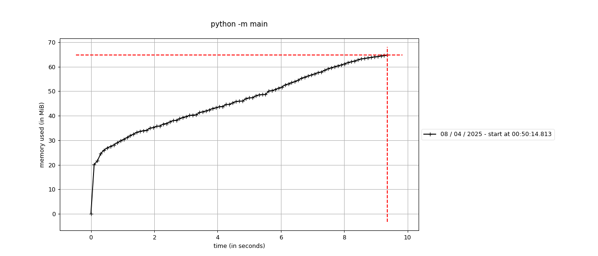

# pydantic v2 memory usage with hundreds of complicated models 

I tried to simplify the large number of complicated models as much as possible. 412 Pydantic models share the same configuration, using strict mode and population by name. The models extensively employ Union and Tagged Union types. They are loaded in the main module and then rebuilt in a separate module. The memory usage increases by over 100MB for all models upon startup.

Copied from another discussion:
> A little about load_models. Because of so deep, nested, and sometimes a bit recursive model structure this is important to load models in a strict order to resolve dependencies of each other. Keeping such order could be hard to achieve from our code generator. Which is a fully automated process. That's why model rebuilding happens in runtime when all the models are defined already. load_models at the end calls model_rebuild for each existing model but the model_rebuild method is pretty smart to does nothing if the model is completely loaded (all types are resolved correctly). So there is no overhead.

## Reproduce

Install main deps:
```bash
pip install pydantic typing_extensions
```

Install deps to reproduce memory growth:
```bash
pip install memory-profiler matplotlib
```

Run the command:
```bash
mprof run python -m main && mprof plot -o mprofile.png
```

## Results

### Used pydantic

```text
             pydantic version: 2.8.2
        pydantic-core version: 2.20.1
          pydantic-core build: profile=release pgo=false
                 install path: blabla/projects/pydantic-memory-usage/venv/lib/python3.9/site-packages/pydantic
               python version: 3.9.6 (default, Mar 29 2024, 10:51:09)  [Clang 15.0.0 (clang-1500.3.9.4)]
                     platform: macOS-14.5-arm64-arm-64bit
             related packages: typing_extensions-4.12.2
                       commit: unknown
```

### time

time python main.py (with commented `@profile`):
```text
python main.py  1.25s user 0.06s system 99% cpu 1.317 total
```

### mprof


```text
Filename: blabla/projects/pydantic-memory-usage/models/models_loader.py

Line #    Mem usage    Increment  Occurrences   Line Contents
=============================================================
    29     43.8 MiB     43.8 MiB           1   @profile
    30                                         def __rebuild_all_models() -> None:
    31                                             # load models to the scope
    32     43.8 MiB      0.0 MiB           1       import models  # noqa
    33     43.8 MiB      0.0 MiB           1       from models.unknown_type import UnknownType, UnknownInputType  # noqa
    34                                         
    35    121.3 MiB      0.0 MiB         369       for __model in __get_models_to_rebuild_set():
    36    121.3 MiB     77.5 MiB         368           __model.model_rebuild()


Filename: blabla/projects/pydantic-memory-usage/main.py

Line #    Mem usage    Increment  Occurrences   Line Contents
=============================================================
     4     18.5 MiB     18.5 MiB           1   @profile
     5                                         def main() -> None:
     6    121.3 MiB    102.8 MiB           1       import models  # noqa
```

## Results with `experimental_fast_build` 

I've added `experimental_fast_build=True` to the `model_config` in `base.py`.

### Used pydantic

```text
             pydantic version: 2.9.0a1
        pydantic-core version: 2.21.0
          pydantic-core build: profile=release pgo=false
                 install path: blabla/projects/pydantic-memory-usage/venv/lib/python3.9/site-packages/pydantic
               python version: 3.9.6 (default, Mar 29 2024, 10:51:09)  [Clang 15.0.0 (clang-1500.3.9.4)]
                     platform: macOS-14.6-arm64-arm-64bit
             related packages: typing_extensions-4.12.2
                       commit: unknown
```

### time

time python main.py (with commented `@profile`):
```text
python main.py  0.97s user 0.06s system 94% cpu 1.081 total
python main.py  0.94s user 0.04s system 99% cpu 0.987 total
python main.py  1.11s user 0.05s system 98% cpu 1.180 total
python main.py  0.97s user 0.04s system 99% cpu 1.022 total
```
(4 runs)

### mprof



```text
Filename: blabla/projects/pydantic-memory-usage/models/models_loader.py

Line #    Mem usage    Increment  Occurrences   Line Contents
=============================================================
    29     43.1 MiB     43.1 MiB           1   @profile
    30                                         def __rebuild_all_models() -> None:
    31                                             # load models to the scope
    32     43.1 MiB      0.0 MiB           1       import models  # noqa
    33     43.2 MiB      0.0 MiB           1       from models.unknown_type import UnknownType, UnknownInputType  # noqa
    34                                         
    35    123.6 MiB      0.0 MiB         369       for __model in __get_models_to_rebuild_set():
    36    123.6 MiB     80.4 MiB         368           __model.model_rebuild()


Filename: blabla/projects/pydantic-memory-usage/main.py

Line #    Mem usage    Increment  Occurrences   Line Contents
=============================================================
     4     18.4 MiB     18.4 MiB           1   @profile
     5                                         def main() -> None:
     6    123.6 MiB    105.2 MiB           1       import models  # noqa
```

## Results with `skip caching parent namespaces`

### time

time python main.py (with commented `@profile`):
```text
python main.py  1.10s user 0.06s system 90% cpu 1.280 total
python main.py  0.99s user 0.05s system 98% cpu 1.048 total
python main.py  1.06s user 0.05s system 98% cpu 1.120 total
python main.py  0.95s user 0.05s system 98% cpu 1.012 total
```
(4 runs)

### mprof


```text
Filename: blabla/projects/pydantic-memory-usage/models/models_loader.py

Line #    Mem usage    Increment  Occurrences   Line Contents
=============================================================
    29     44.4 MiB     44.4 MiB           1   @profile
    30                                         def __rebuild_all_models() -> None:
    31                                             # load models to the scope
    32     44.4 MiB      0.0 MiB           1       import models  # noqa
    33     44.4 MiB      0.0 MiB           1       from models.unknown_type import UnknownType, UnknownInputType  # noqa
    34                                         
    35    129.2 MiB      0.0 MiB         369       for __model in __get_models_to_rebuild_set():
    36    129.2 MiB     84.8 MiB         368           __model.model_rebuild()


Filename: blabla/projects/pydantic-memory-usage/main.py

Line #    Mem usage    Increment  Occurrences   Line Contents
=============================================================
     4     18.2 MiB     18.2 MiB           1   @profile
     5                                         def main() -> None:
     6    129.2 MiB    111.0 MiB           1       import models  # noqa
```
